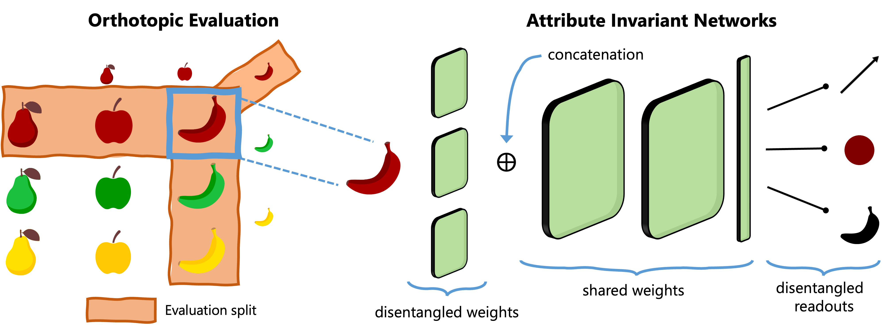

# Scalable Evaluation and Neural Models for Compositional Evaluation

#### Giacomo Camposampiero, Pietro Barbiero, Michael Hersche, Roger Wattenhofer, Abbas Rahimi

Accepted as Conference Paper at the Thirty-ninth Annual Conference on Neural Information Processing Systems (NeurIPS) 2025 [[Paper]](https://arxiv.org/abs/2511.02667).

<div align="center">
  
</div>


## 🔧 Requirements

We recommend using `conda` or `mamba` as the Python package manager. To create a virtual environment with all project dependencies, run:

```bash
mamba env create -f env.yml -y
```

Once the environment is created, complete the setup by running:

```bash
mamba activate neurips
pre-commit install
pre-commit run --all-files
```

> ⚠️ The last two commands are not strictly required but are **strongly recommended** to ensure consistent code formatting and improved readability.
> Running the commands will result in some failures, which will be however automatically fixed.

We use **Weights & Biases** (W&B) to track training runs. To install and authenticate W&B, run:

```bash
pip install wandb
wandb login
```

If you'd like to use a different experiment logger, please refer to and extend the logging interface provided in `visgen.utils.general.logger`.

---

## 📁 Datasets
You can download the pre-processed (tensorized) datasets with:
```bash
# Download the zipped dataset
wget --no-check-certificate "https://drive.usercontent.google.com/download?id=13OClP3D6yy7pVtQRsQ1246N6eLix10GV&confirm=t" -O data.zip

# Extract the contents
unzip data.zip -d data

# Clean up
rm data.zip
```

If you'd like to store the datasets in a different location, update the `training.dataset.path` and `testing.dataset.path` attributes in the relevant dataset configuration files accordingly.
More information on dataset formatting and parsing is available in `data/README.md`.

---

## 🏋️‍♀️ Training the Models
To reproduce the training of the models, use the provided runner scripts:

```bash
./[orthotopic|pairwise]_runner.sh <dataset> <experiment> <model>
```

### Arguments:
- `dataset`: Name of the dataset. One of: `iraven, dsprites, mpi3d, shapes3d, cars3d`.
- `experiment`: Name of the experiment configuration file (omit `.yml` extension).
- `model`: Name of the model configuration (see `configs/models` for options, also omit `.yml`).

Training outputs will be saved in the `out/` directory and can be post-processed with:
```bash
python out/parse_out.py
```

For instance, to replicate the ResNet18 orthotopic results on the I-RAVEN dataset, use
```bash
./orthotopic_runner.sh iraven orthotopic resnet18
```

---

## 📊 Reproducing Results
The `results/` directory contains data extracted from training runs and code (via Jupyter notebook) to replicate the key figures and tables from the paper.

---

## Citation 📚
If you use the work released here for your research, please consider citing our paper:
```
@inproceedings{camposampiero2025scalable,
  title={Scalable Evaluation and Neural Models for Compositional Generalization},
  author={Camposampiero, Giacomo and Barbiero, Pietro and Hersche, Michael and Wattenhofer, Roger and Rahimi, Abbas},
  booktitle={The Thirty-ninth Annual Conference on Neural Information Processing Systems},
  year={2025}
}
``` 

## 📜 License
Please refer to the `LICENSE` file for details on the code’s licensing.
